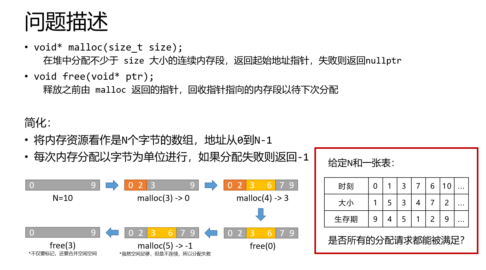
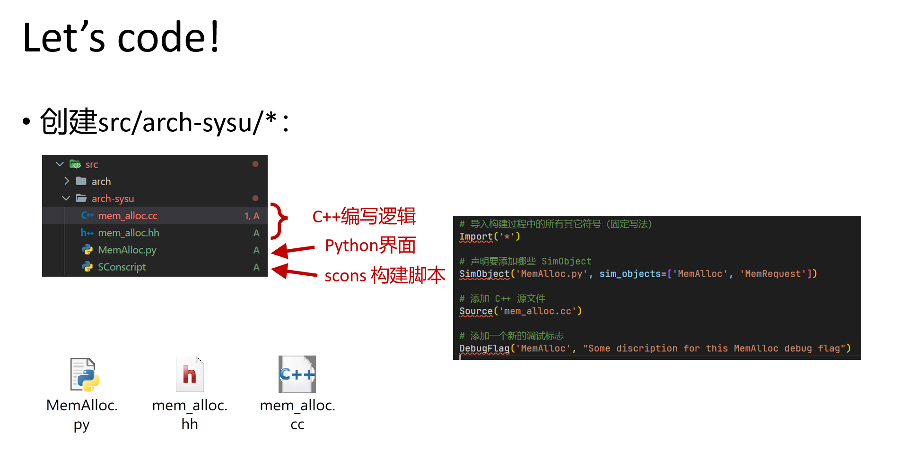
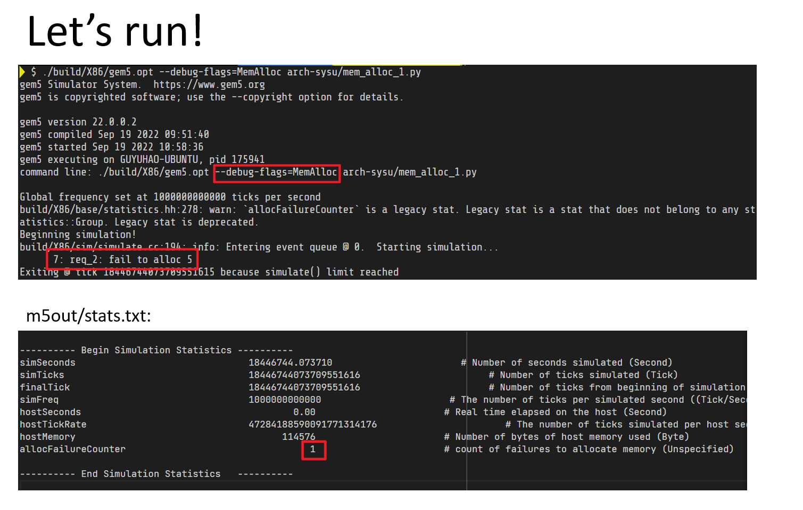
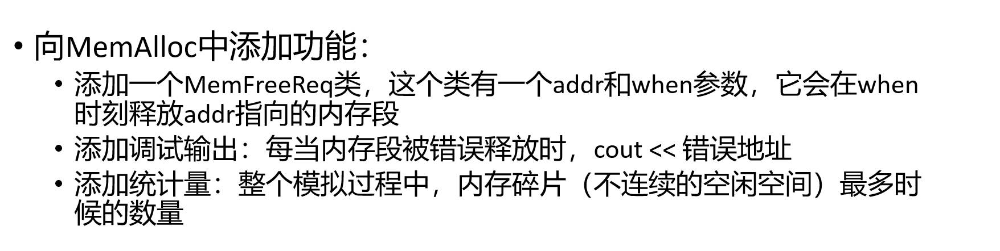

# Malloc and Free LAB
{: .no_toc }

## Table of contents
{: .no_toc .text-delta }

1. TOC
{:toc}
---

{: .outline}
> At this part, you will create a simObject that focuses on "Malloc and Free" and add some functionalities for it.

{: .challenge}
> Note that Malloc and Free LAB is a challenge part

## Problem description

)

## Build and run template simobject

{: .highlight}
> You can find template code at [here](https://github.com/arcsysu/SYSU-ARCH/tree/latest/assets/LAB1)

## Your task

