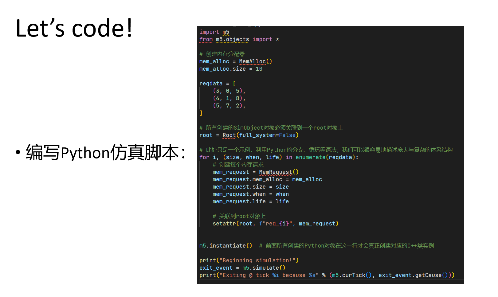

# Malloc and Free LAB
{: .no_toc }

## Table of contents
{: .no_toc .text-delta }

1. TOC
{:toc}
---

{: .outline}
> At this part, you will create a simObject that focuses on "Malloc and Free" and add some functionalities for it.

## Problem description

)

## Build and run template simobject

You can find template code at [this](https://github.com/gty111/SYSU-ARCH-material/tree/main/LAB1) .

## Your task

