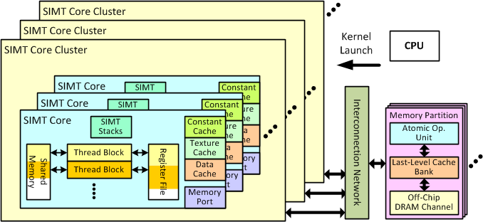

# V Explore GPGPU-SIM and GEMM
{: .no_toc }

## Table of contents
{: .no_toc .text-delta }

1. TOC
{:toc}
---

{: .outline}
> At this part, you will tune GEMM and learn the basic use of GPGPU-SIM



GPGPU-SIM is a simulator for CUDA program. GPGPU-SIM is a little outdated from GEM5. But it is still acknowledged by academic field.

## Build [GPGPU-SIM](http://www.gpgpu-sim.org/)

### Build GPGPU-SIM by docker

Due to the complexity of building GPGPU-SIM, we provide a docker image that you can use dircetly. The image include prebuilt GPGPU-SIM by spack. 
```
docker pull gtyinstinct/gpgpu-sim:spack
```

### Usage of the docker image

- to activate spack env

```
. /opt/spack/share/spack/setup-env.sh
```

- to find installed package

```
spack find 
```

- to load installed package

```
spack load <package name@package version>
```

{: .highlight}
> If you feel the image is too big(about 3GB), you can [build it on your own](https://github.com/gty111/sysu-scc-spack-repo)

## Tips about GPGPU-SIM 

- You may find these helpful
  - [official manual](http://gpgpu-sim.org/manual/index.php/Main_Page)
  - [install GPGPU-SIM](https://github.com/wu-kan/wu-kan.github.io/blob/a94869ef1f1f6bf5daf9535cacbfc69912c2322b/_posts/2022-01-27-%E6%A8%A1%E6%8B%9F%E5%99%A8%20GPGPU-Sim%20%E7%9A%84%E4%BD%BF%E7%94%A8%E4%BB%8B%E7%BB%8D.md)
  - [use GPGPU-SIM](https://github.com/gty111/SimpleUseGpgpuSim)

## GEMM

General Matrix Multiply (GEMM) is a common algorithm in linear algebra, machine learning, statistics, and many other domains.  It provides a more interesting trade-off space, as there are many ways to break up the computation. This includes using blocking, inner products, outer products, and systolic array techniques.

At this part of LAB, we provide a [GEMM template code](https://github.com/gty111/SYSU-ARCH-material/blob/main/LAB5/simpleGEMM_LAB.cu) of [CUDA](https://docs.nvidia.com/cuda/cuda-c-programming-guide/index.html), your task is as follows:

- simulate GEMM template code in GPGPU-SIM and find out the weakness of it

{: .challenge}
> you can do whatever you want with the code except the basic test frame in order to improve the performance of the GEMM 

{: .highlight}
> `Hint` you can simulate the modified code in GPGPU-SIM to validate the improvement of performance.

{: .question}
> What parameters do you think should be used to evaluate GEMM performance? Why?

## Submit

- The output of simulating GEMM template code in GPGPU-SIM

