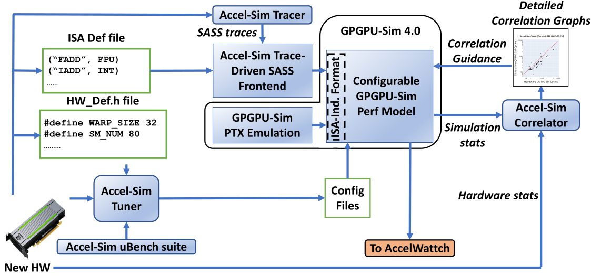

# VI Explore ACCEL-SIM and Cache

{: .outline}
> At this part, you will learn ACCEL-SIM and knowledge about cache

[ACCEL-SIM](https://accel-sim.github.io/) is a new generation of GPGPU-SIM. The main difference between them is that ACCEL-SIM proposes a new energy model and SASS front end. And ACCEL-SIM provides many python scripts to simplify the execution and output data collection.

## Tutorials

- [Accel-SIM-Code-Study](https://apuaachen.github.io/Accel-SIM-Code-Study/)